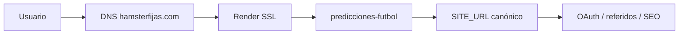

# Lanzamiento público — hamsterfijas.com

> **Nota:** Esta guía es para cuando conectes el dominio. Mientras tanto, la app usa la URL de Render (`predicciones-futbol-tmyr.onrender.com`) como `SITE_URL`.

Checklist y pasos para conectar el dominio **hamsterfijas.com** con el servicio en Render.

---

## Antes de empezar

| Requisito | Estado |
|-----------|--------|
| Código en `master` desplegado en Render | ✅ auto-deploy |
| Acceso al registrador del dominio (Cloudflare, Namecheap, etc.) | Tú |
| Acceso a [Render Dashboard](https://dashboard.render.com/) | Tú |
| Acceso a [Google Cloud Console](https://console.cloud.google.com/) (OAuth) | Tú |
| Variables secretas en Render (`GOOGLE_*`, `TWILIO_*`, `YAPE_QR_BASE64`) | Revisar |

---

## Paso 1 — Desplegar el código actual

```bash
cd ~/Projects/predicciones-futbol
git pull origin master
make verify-deploy   # opcional: prueba local en modo producción
git push origin master   # si hay commits pendientes
```

En Render → **predicciones-futbol** → **Events**, espera a que el deploy termine en **Live**.

---

## Paso 2 — Añadir el dominio en Render

1. Abre [Render](https://dashboard.render.com/) → servicio **predicciones-futbol**.
2. **Settings** → **Custom Domains** → **Add Custom Domain**.
3. Añade **`hamsterfijas.com`** (dominio raíz).
4. Añade también **`www.hamsterfijas.com`** (recomendado).
5. Render mostrará los registros DNS que debes crear. **No cierres esa pantalla** hasta copiarlos.

Valores típicos (Render puede variar; usa los que te muestre el dashboard):

| Host / nombre | Tipo | Valor |
|---------------|------|--------|
| `www` | CNAME | `predicciones-futbol-tmyr.onrender.com` |
| `@` (raíz) | A o ALIAS | IP(s) o target que indique Render |

> Si usas **Cloudflare**, deja el proxy naranja **desactivado** (DNS only / gris) hasta que el certificado SSL de Render esté activo. Luego puedes activar proxy si quieres.

---

## Paso 3 — Configurar DNS en tu registrador

1. Entra al panel DNS de donde compraste **hamsterfijas.com**.
2. Crea los registros **exactamente** como los indicó Render en el paso 2.
3. Elimina registros conflictivos (A/CNAME antiguos apuntando a otro sitio).
4. Guarda cambios.

**Propagación:** puede tardar de 5 minutos a 48 horas. Render marcará el dominio como **Verified** cuando resuelva correctamente.

---

## Paso 4 — Esperar certificado SSL

Render emite HTTPS automático (Let's Encrypt) cuando el DNS está bien.

En **Custom Domains** debe aparecer:

- ✅ **Verified**
- ✅ **Certificate issued** (candado verde)

Prueba en el navegador:

- https://hamsterfijas.com/health → debe responder `{"status":"ok"}`
- https://hamsterfijas.com/ → home de Hamster Fijas

---

## Paso 5 — Variable `SITE_URL` en Render

1. Render → **predicciones-futbol** → **Environment**.
2. Confirma o añade:

```
SITE_URL=https://hamsterfijas.com
```

3. **Save Changes** → Render redeployará el servicio.

Esto actualiza:

- URLs canónicas y Open Graph
- Enlaces de referidos (`/referidos`)
- Sitemap (`/sitemap.xml`)

La app también redirige con **301** las visitas a `*.onrender.com` hacia `SITE_URL` (excepto `/health`).

---

## Paso 6 — Google OAuth (login)

1. [Google Cloud Console](https://console.cloud.google.com/) → **APIs & Services** → **Credentials**.
2. Abre tu cliente OAuth 2.0 (Web application).
3. En **Authorized redirect URIs**, añade:

```
https://hamsterfijas.com/auth/callback
https://www.hamsterfijas.com/auth/callback
```

4. Guarda. No hace falta cambiar Client ID/Secret si ya están en Render.

**Prueba:** cierra sesión en el sitio → **Iniciar sesión con Google** → debe volver a hamsterfijas.com sin error `redirect_uri_mismatch`.

---

## Paso 7 — Revisar variables críticas en Render

| Variable | Valor recomendado |
|----------|-------------------|
| `ENVIRONMENT` | `production` |
| `HTTPS_ONLY` | `true` |
| `SITE_URL` | `https://hamsterfijas.com` |
| `YAPE_PAYMENTS_ENABLED` | `true` |
| `YAPE_RECIPIENT_PHONE` | `944717071` |
| `YAPE_QR_BASE64` | QR en base64 (solo en dashboard, no en git) |
| `ADMIN_EMAILS` | tus emails admin |
| `GA_MEASUREMENT_ID` | `G-W394R9W8E7` |
| `CLARITY_PROJECT_ID` | `x51o85xggi` |
| `ENFORCE_UNIQUE_PHONE` | `false` (cambiar a `true` cuando quieras un celular por cuenta) |

---

## Paso 8 — Verificación post-lanzamiento

Marca cada ítem después de probar en **https://hamsterfijas.com**:

- [ ] Home carga; popup de sorteo aparece una vez por sesión
- [ ] Login con Google funciona
- [ ] Verificación SMS (Twilio) funciona
- [ ] Predicciones y marcadores visibles
- [ ] `/referidos` — enlace usa `hamsterfijas.com?ref=...`
- [ ] `/comprar-yape` — flujo Yape y QR privado
- [ ] `/admin` — acceso con email admin
- [ ] `/sitemap.xml` — URLs con dominio hamsterfijas.com
- [ ] Visitar `https://predicciones-futbol-tmyr.onrender.com/` redirige a hamsterfijas.com

---

## Paso 9 — Opcional (recomendado después)

1. **www → raíz:** en Render o Cloudflare, redirige `www.hamsterfijas.com` → `hamsterfijas.com` (o elige www como canónico y ajusta `SITE_URL`).
2. **Google Search Console:** añade la propiedad `hamsterfijas.com` y envía el sitemap `https://hamsterfijas.com/sitemap.xml`.
3. **ENFORCE_UNIQUE_PHONE=true** cuando el tráfico real empiece (evita cuentas duplicadas con el mismo celular).
4. **Cloudflare proxy:** activa CDN/WAF cuando SSL en Render esté estable.

---

## Resumen del flujo



---

## Soporte rápido

| Problema | Solución |
|----------|----------|
| Dominio no verifica en Render | Revisa DNS; espera propagación; quita proxy Cloudflare temporalmente |
| Error OAuth redirect | Añade URI exacta con `/auth/callback` en Google Console |
| Sigue mostrando URL onrender en referidos | Confirma `SITE_URL` en Render y redeploy |
| SSL pendiente | DNS debe apuntar a Render; puede tardar hasta 1 h |
| 502 / app caída | Render → Logs; revisa `DATABASE_URL` y variables obligatorias |
